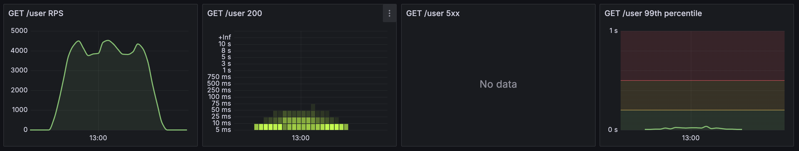
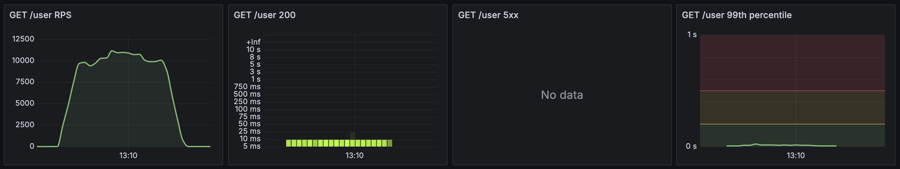

# Kotlin API Demo

This repo contains code for an API written in [Kotlin](https://kotlinlang.org/)
with [Spring Boot](https://spring.io/projects/spring-boot).

## Overview

### Tags

| Tag               | Implementation                                                                                                    | 
|-------------------|-------------------------------------------------------------------------------------------------------------------|
| [v0.1.0](#v0.1.0) | Basic HTTP and gRPC server exposing hello world endpoints.                                                        |
| [v0.2.0](#v0.2.0) | Adds HTTP and gRPC endpoints to create users stored in-memory.                                                    |
| [v0.3.0](#v0.3.0) | Stores created users in-memory or in PostgreSQL.                                                                  |
| [v0.4.0](#v0.4.0) | Adds HTTP and gRPC endpoints to retrieve/read users.                                                              |
| [v0.5.0](#v0.5.0) | Adds telemetry for HTTP and gRPC requests, and contrasts performance when using PostgreSQL and in-memory storage. |

### Set-up

To run the API you'll need to have [Java](https://www.oracle.com/uk/java/technologies/downloads/)
and [Docker](https://docs.docker.com/desktop/) installed.

### Gradle

The [Gradle](https://gradle.org/) build tool can be used for building, running and testing the API.

* `./gradlew bootRun` runs the application without first building an archive.
    * Refer to [Running your Application with Gradle](https://docs.spring.io/spring-boot/gradle-plugin/running.html).
* `./gradlew build` executes the build.
    * The generated .jar can then be run directly using `java -jar build/libs/kotlin_api_demo-<VERSION>.jar`
* `./gradlew test` runs the tests.
* `./gradlew composeUp` and `./gradlew composeDown` will bring-up and
  take-down the Docker containers that are required for running the API.

### Manual Testing

You can test the API manually using a client. For instance
[Insomnia](https://insomnia.rest/download)
supports both HTTP and [gRPC](https://support.insomnia.rest/article/188-grpc#overview).

Alternatively, requests can be issued using cURL and
[gRPCurl](https://github.com/fullstorydev/grpcurl).

## <a name="v0.5.0"></a>v0.5.0

Uses [OpenTelemetry](https://opentelemetry.io/) to add metrics which are
surfaced through [Prometheus](https://prometheus.io/), and visualised using
[Grafana](https://grafana.com/).

### Set-up

```shell
./gradlew composeUp
```

```shell
./gradlew bootRun
```

Prometheus is accessible at http://localhost:9090

Grafana is accessible at http://localhost:3000

* username `admin`, password `admin`
* dashboard for `/user` endpoints is visible under
  `Dashboards - kotlin-api-demo - user`.

### Metrics

Running the cURL or gRPC requests (see [v0.2.0](#v0.2.0) and [v0.4.0](#v0.4.0))
for _user_ endpoints will generate metrics.

Metrics are visible in [Prometheus](http://localhost:9090), for example,
HTTP request duration can be seen by searching for:

* http_server_request_duration_seconds_bucket
* http_server_request_duration_seconds_count
* http_server_request_duration_seconds_sum

### Load Testing

Running the [k6](https://k6.io/) script which issues HTTP GET requests
will generate metrics that are visualised in the
[Grafana](http://localhost:3456) dashboard.

#### <a name="k6_docker"></a>Docker

     docker run -e HOST=host.docker.internal -i grafana/k6 run - <k6/get.js

#### <a name="k6_local"></a>Local

[Install k6](https://grafana.com/docs/k6/latest/set-up/install-k6/) and run:

    k6 run -e HOST=localhost k6/get.js

### <a name="load_testing"></a>Dashboard

Following is the output from running the _k6_ script which ramps up from 1 to
25 virtual users (vus) over 2 minutes, maintains 25 vus for 1 minute, then
ramps down to 0 vus over 2 minutes.

The two load tests were run using either PostgreSQL or in-memory (H2) data
storage (see [v0.3.0](#v0.3.0) for configuration).

#### PostgreSQL



Initially the number of requests per second (RPS) increases as the number of
vus rises, and, an accompanying increase in the request duration can be seen
in the heat map for successful (200) requests.

The RPS plateaus with some fluctuations, before decreasing as the vus are
ramped down, with an accompanying decrease in request duration.

##### k6 Output

```
  execution: local
     script: k6/get.js
     output: -

  scenarios: (100.00%) 1 scenario, 25 max VUs, 5m30s max duration (incl. graceful stop):
           * default: Up to 25 looping VUs for 5m0s over 3 stages (gracefulRampDown: 30s, gracefulStop: 30s)


running (5m00.0s), 00/25 VUs, 1167025 complete and 0 interrupted iterations
default ✓ [======================================] 00/25 VUs  5m0s

     ✓ status was 200

     checks.........................: 100.00% ✓ 1167025     ✗ 0      
     data_received..................: 453 MB  1.5 MB/s
     data_sent......................: 98 MB   327 kB/s
     http_req_blocked...............: avg=2.21µs  min=0s       med=1µs    max=1.97ms p(90)=1µs    p(95)=2µs   
     http_req_connecting............: avg=1.3µs   min=0s       med=0s     max=1.94ms p(90)=0s     p(95)=0s    
     http_req_duration..............: avg=3.88ms  min=494µs    med=3.29ms max=6.12s  p(90)=6.49ms p(95)=8.08ms
       { expected_response:true }...: avg=3.88ms  min=494µs    med=3.29ms max=6.12s  p(90)=6.49ms p(95)=8.08ms
     http_req_failed................: 0.00%   ✓ 0           ✗ 1167025
     http_req_receiving.............: avg=22.69µs min=3µs      med=10µs   max=11.2ms p(90)=44µs   p(95)=76µs  
     http_req_sending...............: avg=2.67µs  min=1µs      med=2µs    max=1.02ms p(90)=3µs    p(95)=7µs   
     http_req_tls_handshaking.......: avg=0s      min=0s       med=0s     max=0s     p(90)=0s     p(95)=0s    
     http_req_waiting...............: avg=3.86ms  min=474µs    med=3.26ms max=6.12s  p(90)=6.47ms p(95)=8.04ms
     http_reqs......................: 1167025 3890.056622/s
     iteration_duration.............: avg=3.9ms   min=509.33µs med=3.31ms max=6.12s  p(90)=6.52ms p(95)=8.1ms 
     iterations.....................: 1167025 3890.056622/s
     vus............................: 1       min=1         max=25   
     vus_max........................: 25      min=25        max=25   
```

#### In-Memory (H2)



Initially the number of requests per second (RPS) increases as the number of
vus rises, with successful (200) request duration remaining stable.

The RPS plateaus before decreasing as the number of vus is ramped down.

##### k6 Output

```
  execution: local
     script: k6/get.js
     output: -

  scenarios: (100.00%) 1 scenario, 25 max VUs, 5m30s max duration (incl. graceful stop):
           * default: Up to 25 looping VUs for 5m0s over 3 stages (gracefulRampDown: 30s, gracefulStop: 30s)


running (5m00.0s), 00/25 VUs, 2984742 complete and 0 interrupted iterations
default ✓ [======================================] 00/25 VUs  5m0s

     ✓ status was 200

     checks.........................: 100.00% ✓ 2984742     ✗ 0      
     data_received..................: 377 MB  1.3 MB/s
     data_sent......................: 251 MB  836 kB/s
     http_req_blocked...............: avg=2.74µs   min=0s       med=0s      max=28.62ms  p(90)=1µs    p(95)=2µs   
     http_req_connecting............: avg=1.63µs   min=0s       med=0s      max=12.93ms  p(90)=0s     p(95)=0s    
     http_req_duration..............: avg=1.49ms   min=143µs    med=721µs   max=361.42ms p(90)=2.34ms p(95)=3.57ms
       { expected_response:true }...: avg=1.49ms   min=143µs    med=721µs   max=361.42ms p(90)=2.34ms p(95)=3.57ms
     http_req_failed................: 0.00%   ✓ 0           ✗ 2984742
     http_req_receiving.............: avg=100.17µs min=2µs      med=17µs    max=276.17ms p(90)=79µs   p(95)=163µs 
     http_req_sending...............: avg=3.39µs   min=1µs      med=2µs     max=119.14ms p(90)=4µs    p(95)=8µs   
     http_req_tls_handshaking.......: avg=0s       min=0s       med=0s      max=0s       p(90)=0s     p(95)=0s    
     http_req_waiting...............: avg=1.39ms   min=128µs    med=673µs   max=360.6ms  p(90)=2.22ms p(95)=3.34ms
     http_reqs......................: 2984742 9949.295872/s
     iteration_duration.............: avg=1.52ms   min=154.79µs med=746.7µs max=361.44ms p(90)=2.38ms p(95)=3.62ms
     iterations.....................: 2984742 9949.295872/s
     vus............................: 1       min=1         max=25   
     vus_max........................: 25      min=25        max=25   
```

## <a name="v0.4.0"></a>v0.4.0

Adds HTTP and gRPC endpoints for retrieving users.

The same cURL and gRPCurl requests as described for [v0.2.0](#v0.2.0) can be
used to create users.

### HTTP

```shell
curl -i --request GET \
--url http://localhost:8080/user
```

```shell
HTTP/1.1 200
Content-Type: application/json
Transfer-Encoding: chunked
Date: Thu, 23 Jan 2025 11:29:16 GMT

[
  {
    "first_name":"john",
    "last_name":"smith",
    "created_at":"2025-01-20T14:07:54.726838",
    "id":"33e19313-df8c-40fb-b217-11ec0ec5a9d4"
  }
]
```

### gRPC

```shell
grpcurl \
-plaintext \
localhost:8082 net.synaptology.kotlin_api_demo.UserReadService.Read
```

```shell
{
  "users": [
    {
      "id": "33e19313-df8c-40fb-b217-11ec0ec5a9d4",
      "first_name": "john",
      "last_name": "smith",
      "created_at": "2025-01-20T14:07:54.726838"
    }
  ]
}
```

## <a name="v0.3.0"></a>v0.3.0

Stores created users either in-memory or in PostgreSQL.

The same cURL and gRPCurl requests as described for [v0.2.0](#v0.2.0) can be used.

### PostgreSQL

To use [PostgreSQL](https://www.postgresql.org/) storage you'll need to have
[Docker](https://docs.docker.com/engine/install/) installed.

Edit `application.yml` and ensure that `profiles.active` is set to
`postgresql`.

```yml
spring:
  profiles.active: postgresql
```

Then run the following command:

```shell
./gradlew composeUp
```

Running the following will terminate and clean-up the PostgreSQL docker
container:

```shell
./gradlew composeDown
```

### H2

To use in-memory storage ([H2](https://www.h2database.com/html/main.html)),
edit `application.yml` and ensure that `profiles.active` is set to `h2`.

## <a name="v0.2.0"></a>v0.2.0

Adding HTTP and gRPC endpoints for user creation.

Users are stored in-memory.

### HTTP

#### Request

    curl -i --request POST \
    --url http://localhost:8080/user \
    --header 'Content-Type: application/json' \
    --data '{
        "first_name": "john",
        "last_name": "smith"
    }'

##### Response

    HTTP/1.1 201
    Content-Type: application/json
    Transfer-Encoding: chunked
    Date: Mon, 23 Dec 2024 03:48:32 GMT

    {
        "first_name":"john",
        "last_name":"smith",
        "created_at":"2024-12-23T03:48:32.778473",
        "id":"8cde7c6f-1b37-4666-bda5-c0f446237963"
    }

### gRPC

#### Request

    grpcurl \
    -plaintext \
    -d '{"first_name": "john", "last_name": "smith"}' \
    localhost:8082 net.synaptology.kotlin_api_demo.UserCreateService.Create

#### Response

    {
        "id": "e3f2505c-dbf3-4b87-96e7-2b94cabec5fd",
        "first_name": "john",
        "last_name": "smith",
        "created_at": "2024-12-23T03:53:18.288108"
    }

## <a name="v0.1.0"></a>v0.1.0

Basic HTTP and gRPC server.

### HTTP

#### Request

    curl -i localhost:8080

##### Response

    HTTP/1.1 200
    Content-Length: 0
    Date: Sat, 14 Dec 2024 14:10:26 GMT

### gRPC

#### Request

    grpcurl -plaintext 
    -d '{"name":"world"}' 
    localhost:8082 net.synaptology.kotlin_api_demo.HelloService.Hello

#### Response

    {
      "message": "Hello, world!"
    }
